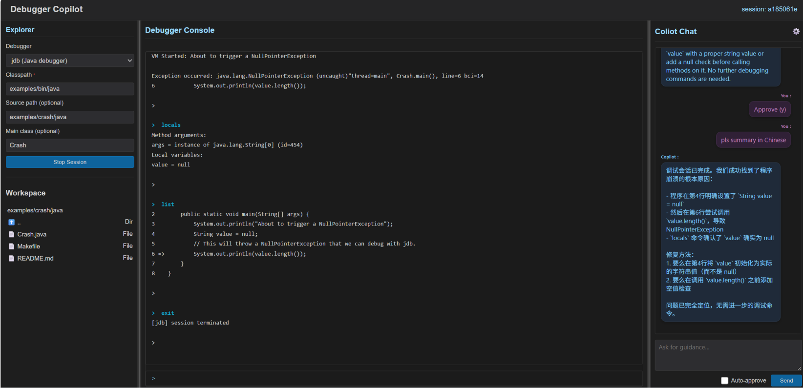

# Debugger Copilot

## Overview
Debugger Copilot is an AI-assisted debugging copilot that works with GDB, LLDB, Delve, Radare2, jdb (Java debugger), and pdb (Python debugger). Rust-aware wrappers such as `rust-gdb` and `rust-lldb` are also supported for Cargo-built experiences. It summarizes outputs, suggests next commands, and orchestrates goal-driven plans while keeping you in control through natural-language prompts.

## Demo highlights
- `dbgcopilot` interactive REPL covering GDB/LLDB/Delve/Radare2/jdb/pdb backends.
- The FastAPI-powered `dbgweb` dashboard.
- The fully autonomous `dbgagent` CLI (demo coming soon).

| Demo | Quick look |
| --- | --- |
|  | `gdb`: crash investigation through the GDB subprocess backend |
|  | `radare2`: raw binary analysis with Copilot guidance |

More demos are available in [docs/media](docs/media/README.md) (click any tile there to open the GIF replay for that debugger).

| Demo | Quick look |
| --- | --- |
|  | `dbgweb`: FastAPI dashboard controlling Copilot sessions |

## Quick links
- [Installation & Testing](docs/install.md)
- [Distribution & Publishing](docs/publishing.md)
- [Loading Debugger Copilot in GDB](docs/gdb.md)
- [Autonomous debugging with `dbgagent`](docs/autonomous.md)
- [LLM provider configuration](docs/llm.md)
- [Notes & LLDB Python API tips](docs/notes.md)
- [Project layout and example programs](docs/project-layout.md)
- [Demo media placeholders](docs/media/README.md)

> **Note:** The `dbgagent` CLI is shipped as a separate wheel from the shared `dbgcopilot` package, so see [Distribution & Publishing](docs/publishing.md) for the build/publish/install steps that cover both wheels.
