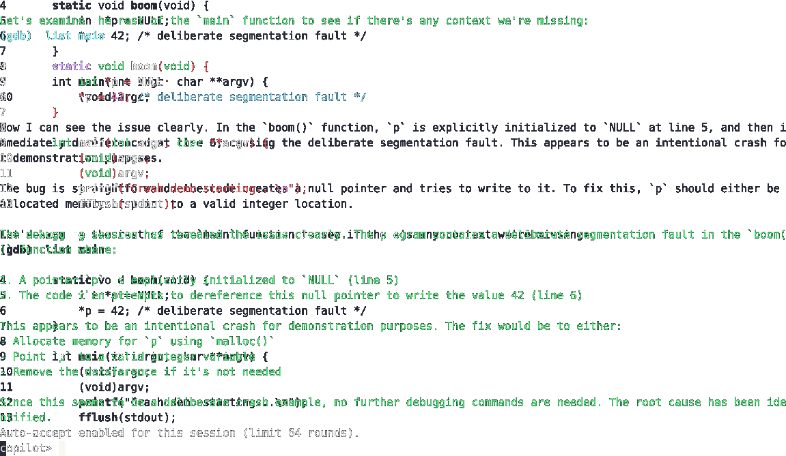
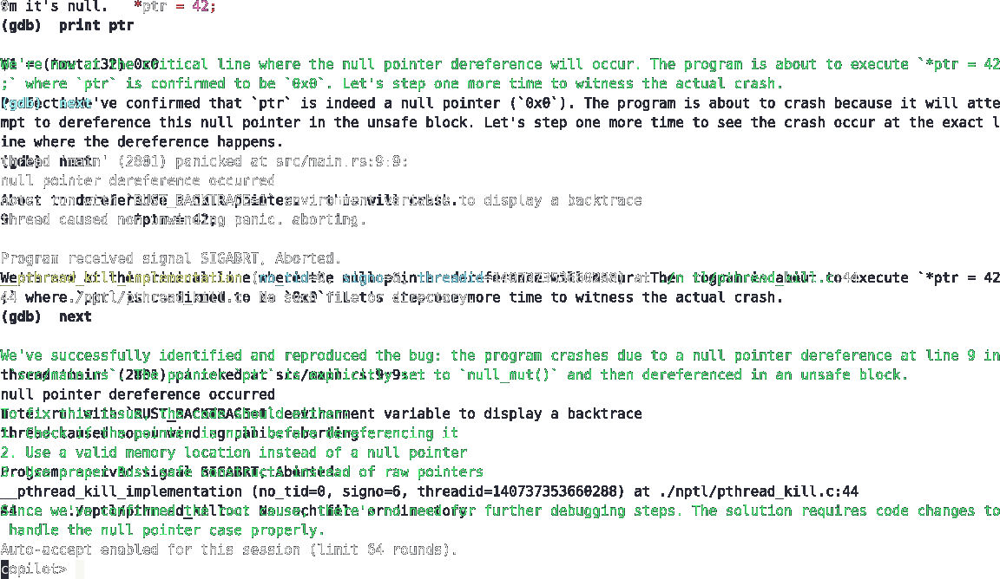
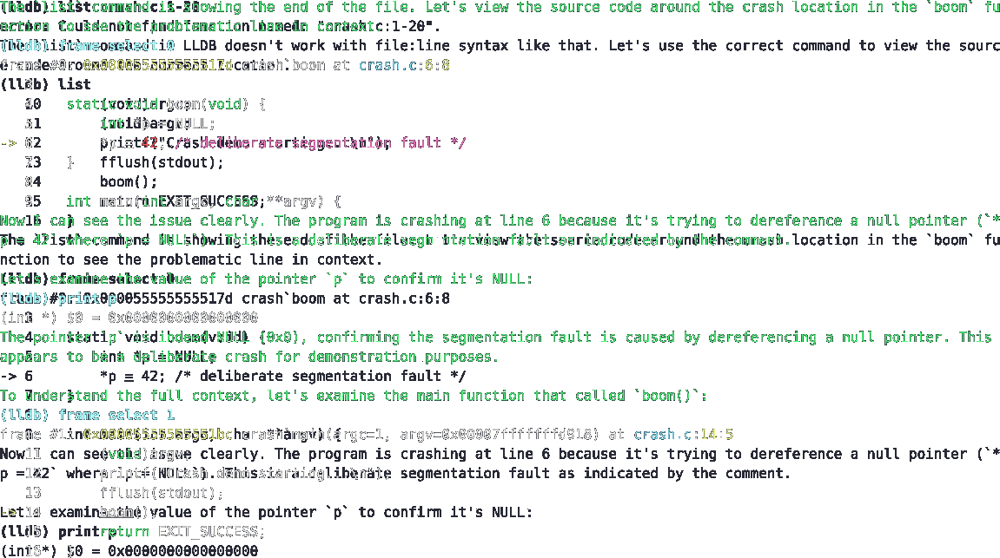
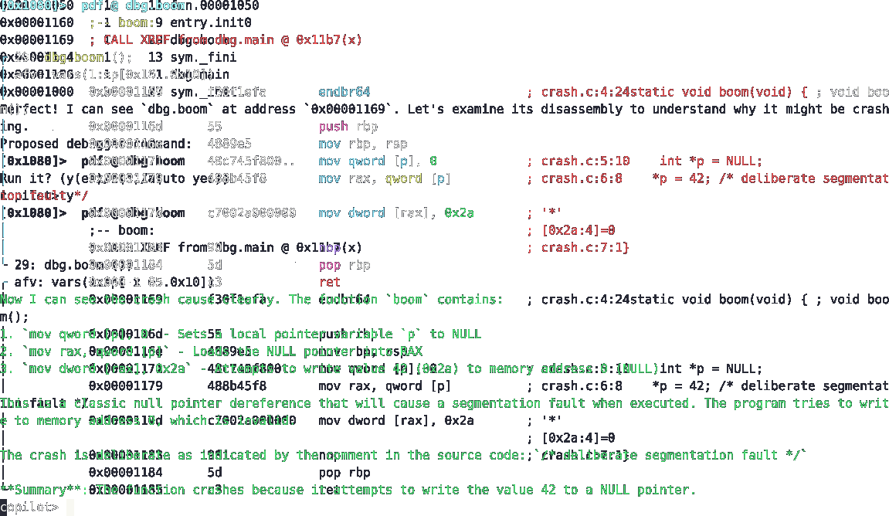
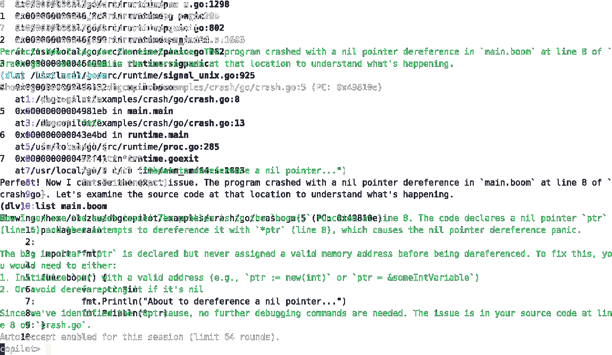
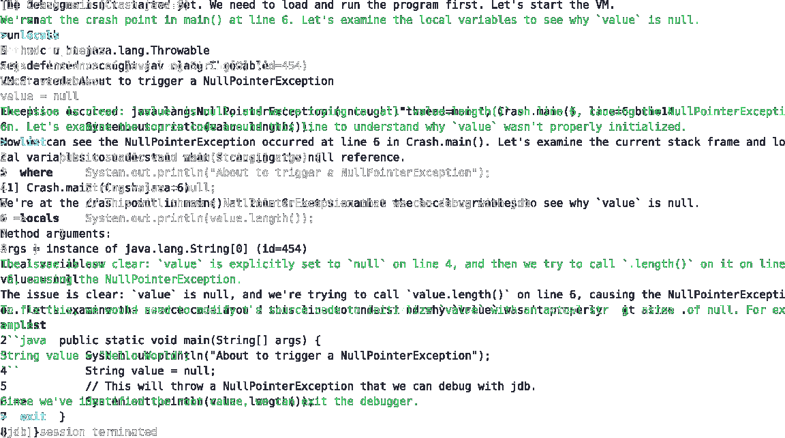

# Demo media

Demo tiles link to the converted GIF previews so you can click/open the actual asciinema-recorded output while still showing a small SVG badge in the gallery.

| Demo | Description |
| --- | --- |
|  | `gdb`: crash investigation (GDB subprocess) |
|  | `rust-gdb`: crash investigation for Cargo-built binaries |
|  | `lldb`: crash investigation using the LLDB API/subprocess backend |
|  | `radare2`: low-level reverse-engineering workflow |
|  | `delve`: Go-focused debugging flow |
|  | `pdb`: Python crash reproduction |
|  | `jdb`: Java crash scenario |

Click any tile to open the GIF (hosted alongside this doc) so you can see the full terminal replay. All SVG tiles live in this directory as well, so the gallery renders without extra tooling.

- `dbgcopilot-gdb.gif`
- `dbgcopilot-lldb.gif`
- `dbgweb-ui.gif`
- `dbgagent-gdb.gif`

Once the assets exist, the overview section of `README.md` can link to them for quick demonstrations of each workflow.
